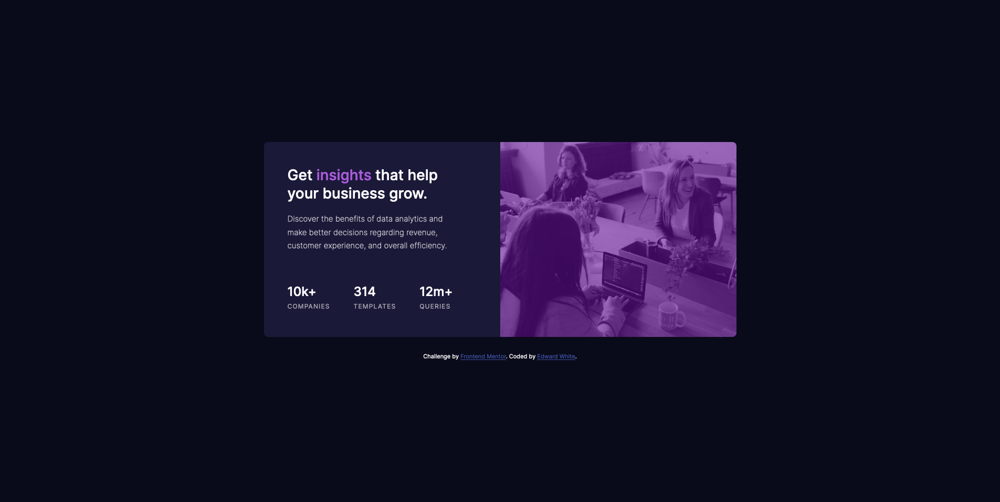

# Frontend Mentor - Stats preview card component solution

This is a solution to the [Stats preview card component challenge on Frontend Mentor](https://www.frontendmentor.io/challenges/stats-preview-card-component-8JqbgoU62). Frontend Mentor challenges help you improve your coding skills by building realistic projects.

## Table of contents

- [Overview](#overview)
  - [The challenge](#the-challenge)
  - [Screenshot](#screenshot)
  - [Links](#links)
- [My process](#my-process)
  - [Built with](#built-with)
  - [What I learned](#what-i-learned)
- [Author](#author)

## Overview

### The challenge

Users should be able to:

- View the optimal layout depending on their device's screen size

### Screenshot

Desktop:

Mobile:


### Links

- Solution URL: [Frontend Mentor](https://www.frontendmentor.io/solutions/stats-preview-card-component-vanilla-css-only-vPS_1ugrA)
- Live Site URL: [GitHub pages](https://ewhite1999.github.io/stats-preview-card-component-main/)

## My process

### Built with

- Flexbox
- Mobile-first workflow

### What I learned

I learnt that you can center the page by using flexbox on the body element with height of 100vh:

```css
.body {
  height: 100vh;
  display: flex;
  flex-direction: column;
  justify-content: center;
}
```

## Author

- Frontend Mentor - [@ewhite1999](https://www.frontendmentor.io/profile/ewhite1999)
